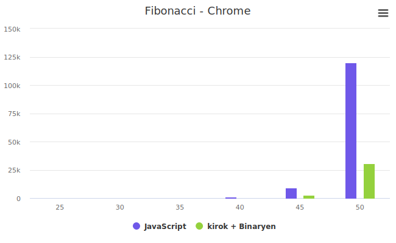
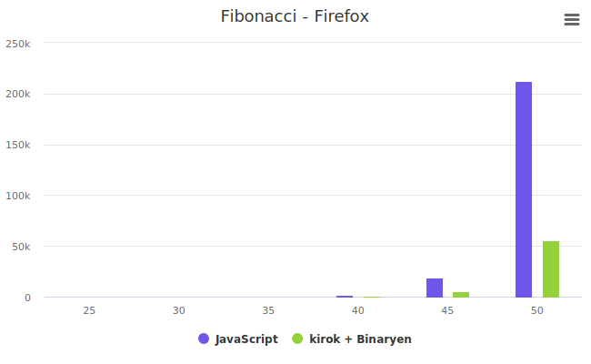

# 성능

kirok는 Wasm으로 컴파일되어 JS보다 뛰어난 성능을 제공합니다.
성능을 측정해 봅시다.

## 테스트 환경
- 브라우저: Chrome 117.0.5938.89, Firefox 117.0.1
- OS: Windows 11
- CPU: AMD Ryzen 9 5950X
- RAM: 64GB
- 비교군: 브라우저 별로 JavaScript, kirok + Binaryen

## Fibonacci
_연산 성능 테스트_

5부터 50까지 피보나치 수를 계산합니다.
```kotlin
@Serializable
@Model
data class Fibonacci(var n: Int, var result: Int)

@Init
fun initFibonacci(): Fibonacci = Fibonacci(0, 0)

@Intent
fun calculate(fibonacci: Fibonacci) {
    val n = fibonacci.n
    fibonacci.result = if (n <= 1) {
        n
    } else {
        getFibonacci(n - 1) + getFibonacci(n - 2)
    }
}

fun getFibonacci(n: Int): Int {
    return if (n <= 1) {
        n
    } else {
        getFibonacci(n - 1) + getFibonacci(n - 2)
    }
}
```

```html
<!-- App.svelte -->
<script lang="ts">
    import { onMount } from "svelte";
    import { useFibonacci } from "./kirok/Fibonacci";

    const [fibonacci, { calculate }] = useFibonacci();
    function jsFibonacci(n: number): number {
        if (n < 2) return n;
        return jsFibonacci(n - 1) + jsFibonacci(n - 2);
    }

    onMount(async () => {
        for (let i = 5; i <= 50; i += 5) {
            console.log(`n: ${i}`);

            let start = performance.now();
            let result = jsFibonacci(i);
            let end = performance.now();
            console.log(`js: ${Math.round(end - start)}ms`);
            document.body.innerHTML += `<br> ${i}th: JS, calculated in ${
                    Math.round(end - start)
            }ms.`;

            await new Promise((resolve) => setTimeout(resolve, 1000));

            start = performance.now();
            $fibonacci.n = i;
            await calculate();
            end = performance.now();
            console.log(`kirok: ${Math.round(end - start)}ms`);
            document.body.innerHTML += `<br> WASM, calculated in ${
                    Math.round(end - start)
            }ms.`;
        }
    });
</script>

```

### 테스트 결과
낮은 숫자가 더 빠릅니다. 5부터 50까지 5씩 증가시키며 테스트했으며 5~25는 1ms 이하이므로 생략했습니다.
#### Chrome

| n     | JavaScript(ms) | kirok + Binaryen(ms) |
|-------|----------------|----------------------|
| n: 25 | 1              | 0                    |
| n: 30 | 7              | 2                    |
| n: 35 | 74             | 23                   |
| n: 40 | 823            | 246                  |
| n: 45 | 9,143          | 2,756                |
| n: 50 | 119,937        | 30,552               |



#### Firefox

| n     | JavaScript(ms) | kirok + Binaryen(ms) |
|-------|----------------|----------------------|
| n: 25 | 1              | 1                    |
| n: 30 | 15             | 5                    |
| n: 35 | 156            | 43                   |
| n: 40 | 1,735          | 451                  |
| n: 45 | 19,177         | 4,991                |
| n: 50 | 212,266        | 55,667               |



kirok이 JavaScript의 4배의 성능을 보여줍니다.

## Too Much Fibonacci
_호출 성능 테스트_

10부터 30까지 10씩 증가시키며 테스트합니다.
각 테스트를 500번에서 2500번까지 500씩 증가시키며 반복하고 총 시간을 측정합니다.
```html
<!-- App.svelte -->
<script lang="ts">
    import { onMount } from "svelte";
    import { useFibonacci } from "./kirok/Fibonacci";

    const [fibonacci, { calculate }] = useFibonacci();
    function jsFibonacci(n: number): number {
        if (n < 2) return n;
        return jsFibonacci(n - 1) + jsFibonacci(n - 2);
    }

    onMount(async () => {
        for (let i = 5; i <= 30; i += 5) {
            for (let j = 500; j <= 2500; j += 500) {
                const jsStart = performance.now();
                for (let k = 0; k < j; k++) {
                    jsFibonacci(i);
                }
                const jsEnd = performance.now();
                const jsPerf = jsEnd - jsStart;

                $fibonacci.n = i;
                const start = performance.now();
                for (let k = 0; k < j; k++) {
                    calculate();
                }
                const end = performance.now();
                const wasmPerf = end - start;

                document.body.innerHTML += `i=${i} j=${j} JS ${Math.round(
                        jsPerf
                )}ms WASM ${Math.round(wasmPerf)}ms<br>`;

                await new Promise((resolve) => setTimeout(resolve, 1000));
            }
        }
    });
</script>
```

### 테스트 결과
낮은 숫자가 더 빠릅니다.
#### Chrome

| i, j         | JavaScript(ms) | kirok + Binaryen(ms) |
|--------------|----------------|----------------------|
| i=5  j=500   | 0              | 8                    |
| i=5  j=1000  | 0              | 11                   |
| i=5  j=1500  | 0              | 13                   |
| i=5  j=2000  | 0              | 11                   |
| i=5  j=2500  | 0              | 13                   |
| i=10  j=500  | 0              | 3                    |
| i=10  j=1000 | 1              | 4                    |
| i=10  j=1500 | 1              | 6                    |
| i=10  j=2000 | 1              | 8                    |
| i=10  j=2500 | 1              | 9                    |
| i=15  j=500  | 2              | 3                    |
| i=15  j=1000 | 5              | 5                    |
| i=15  j=1500 | 7              | 7                    |
| i=15  j=2000 | 10             | 10                   |
| i=15  j=2500 | 12             | 11                   |
| i=20  j=500  | 28             | 10                   |
| i=20  j=1000 | 55             | 19                   |
| i=20  j=1500 | 82             | 29                   |
| i=20  j=2000 | 110            | 39                   |
| i=20  j=2500 | 137            | 49                   |
| i=25  j=500  | 335            | 93                   |
| i=25  j=1000 | 655            | 188                  |
| i=25  j=1500 | 912            | 282                  |
| i=25  j=2000 | 1,283          | 374                  |
| i=25  j=2500 | 1,500          | 462                  |
| i=30  j=500  | 3,356          | 1,009                |
| i=30  j=1000 | 6,723          | 2,042                |
| i=30  j=1500 | 10,080         | 3,044                |
| i=30  j=2000 | 13,483         | 4,074                |
| i=30  j=2500 | 16,808         | 5,107                |

#### Firefox

| i, j        | JavaScript(ms) | kirok + Binaryen(ms) |
|-------------|----------------|----------------------|
| i=5 j= 500  | 0              | 9                    |
| i=5 j=1000  | 0              | 13                   | 
| i=5 j=1500  | 0              | 14                   | 
| i=5 j=2000  | 0              | 22                   | 
| i=5 j=2500  | 1              | 28                   | 
| i=10 j=500  | 1              | 4                    | 
| i=10 j=1000 | 1              | 12                   |
| i=10 j=1500 | 2              | 18                   |
| i=10 j=2000 | 2              | 27                   |
| i=10 j=2500 | 2              | 40                   |
| i=15 j=500  | 5              | 10                   |
| i=15 j=1000 | 11             | 21                   |
| i=15 j=1500 | 16             | 30                   |
| i=15 j=2000 | 20             | 30                   |
| i=15 j=2500 | 26             | 36                   |
| i=20 j=500  | 57             | 19                   |
| i=20 j=1000 | 114            | 41                   |
| i=20 j=1500 | 169            | 65                   |
| i=20 j=2000 | 227            | 87                   |
| i=20 j=2500 | 284            | 104                  |
| i=25 j=500  | 634            | 174                  |
| i=25 j=1000 | 1,277          | 346                  |
| i=25 j=1500 | 1,962          | 566                  |
| i=25 j=2000 | 2,570          | 697                  |
| i=25 j=2500 | 3,237          | 871                  |
| i=30 j=500  | 7,118          | 1,936                |
| i=30 j=1000 | 14,406         | 3,804                |
| i=30 j=1500 | 21,202         | 5,588                |
| i=30 j=2000 | 28,076         | 7,416                |
| i=30 j=2500 | 35,175         | 9,247                |

여기서도, 3~4배의 성능을 보여줍니다. 단, 연산이 적고 호출이 많은 경우에는 성능이 떨어집니다.
이는 호출할 때의 오버헤드로 보이며, 많은 연산에서는 오버헤드를 상쇄할 만큼의 성능을 보여줍니다.
